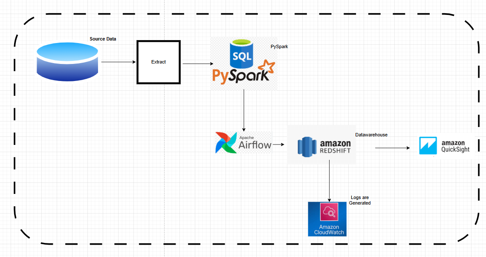

# System Logs Analytics Pipeline - Eventify

Eventify’s platform generates application log files capturing user actions such as logins,
event creation,location, user device and errors. These logs are currently generated from
servers, stored as csv files locally and are primarily used by engineers for system
understanding.

## Problem Statement

- Application logs are:
  Stored as raw, csv files
  Difficult to query or analyze
  Not centrally available for analytics teams
  Inconsistent in formatting and occasionally malformed

## Challenges 
 -Analysts cannot answer basic questions (e.g., daily logins, error rates)
Product teams lack visibility into user behavior
Operations teams manually inspect logs during incidents
The company needs a reliable ETL pipeline to convert raw log files into a structured event
table stored in a database.

##  Project Objectives
 - Extracts raw application log files
 - Parses and cleans log data
 -  Handles invalid or corrupt log entries gracefully
 -  Loads clean, structured events into a relational database
 - Produces an analytics-ready event tableepostairflow

 

##  Rationale for the Project

 **This project mirrors a data engineering problem where:**
 - Data is not clean and analytically acceptable
 - Input files may contain errors
 - Data must be made usable for downstream teams

 ##  Tools

 - PySpark
 - Sql
 - Airflow
 - Amazon Redshift
 - Amazon CloudWatch
 - Amazon QuickSight

 ## Apache PySpark
 -Big Data Processing

Handles massive datasets (terabytes to petabytes) that can’t fit on one machine.

Runs computations in parallel across many servers.

-ETL Pipelines

Extract, Transform, Load large datasets.

Example: Clean logs, transform raw JSON into tables, load into Redshift/S3.

-Data Analysis

Aggregations, filtering, joins, group-by operations on huge datasets.

Works like pandas but distributed and scalable.

-Streaming Data

Real-time processing using Spark Streaming or Structured Streaming.

 ## sql
 -A programming language specifically designed to work with databases.

Used to store, retrieve, and manipulate structured data (tables with rows and columns).

 ## Airflow
 -Schedules Tasks

Run jobs at set times (daily, hourly, every minute, etc.)

-Manages Dependencies

Ensures tasks run in the right order.

-Monitors Jobs

Tracks which tasks succeed, fail, or retry.

Sends alerts if something goes wrong.

-Automates ETL Pipelines

Extract data from source → transform → load into warehouse (Redshift, Snowflake, BigQuery)

 ## Amazon Redshift
 -Analytics & Reporting

Run complex queries on massive datasets fast.

Business Intelligence (BI) Dashboards

Connects to tools like Looker, QuickSight, Tableau.

Feeds dashboards for decision-makers.

-Data Warehousing

Combine data from multiple sources:

S3, RDS, operational databases, logs, APIs

Store it in a structured, query-friendly format.

-ETL/ELT Pipelines

Redshift is usually the final storage layer in a data pipeline.

 ## Amazon CloudWatch
  -Monitoring Metrics

-Track CPU, memory, disk usage, network activity for:

-EC2 instances

-RDS databases

-Lambda functions

-Redshift clusters

-Logs Collection

-Collect logs from applications, servers, or services.

-Alarming & Notifications

-Trigger alerts when something goes wrong

 ## Amazon QuickSight
  -ashboards & Reports

-Build interactive dashboards for business users.

-Data Exploration

-Analyze datasets without writing SQL manually.

-Drill down into metrics, filter by dimensions, create charts.

-Data Integration

-ML Insights

-Provides automated forecasting, anomaly detection, and trend analysis using built-in machine learning.

-Sharing & Collaboration

-Share dashboards with colleagues or embed in apps.

